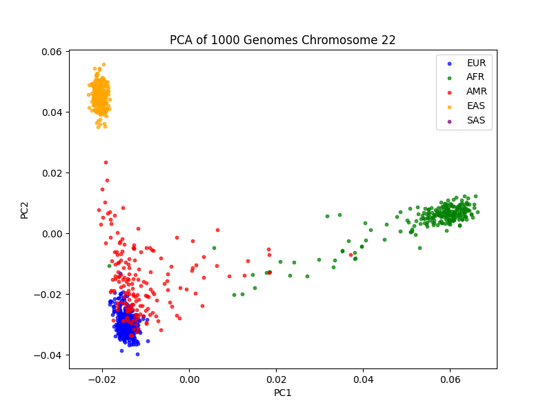

# Population Genetic Analysis of Chromosome 22 in the Context of Crohn’s Disease

## Introduction
- Crohn’s disease is a chronic inflammatory bowel disease with a strong genetic component.
- Disease prevalence varies across populations (e.g., highest in Europeans).
- This project uses 1000 Genomes chromosome 22 data to visualize population structure and relate it to Crohn’s risk allele frequencies.

## Methods
- **Data**: 1000 Genomes Phase 3, chromosome 22 (PLINK files: chr22_data.bed/.bim/.fam).
- **Population labels**: Downloaded from ftp.1000genomes.ebi.ac.uk (integrated_call_samples_v3...panel).
- **PCA**: Performed with PLINK v1.9 (`--pca 10`) on all chr22 SNPs.
- **Visualization**: Python (pandas, matplotlib) to merge eigenvectors with population labels and plot PC1 vs PC2.

## Results

- PC1 separates African (AFR) from non-African populations.
- PC2 separates East Asian (EAS) from European (EUR).
- Admixed American (AMR) cluster between EUR and AFR.
- South Asian (SAS) are near EUR but distinct.
- This pattern matches known human migration history.

## Discussion
- Many Crohn’s risk alleles (e.g., in *NOD2*, *IL23R*) show frequency differences across populations that mirror the PCA clusters.
- Although none of the 10 Crohn-associated SNPs from chromosome 22 were present in the 1000 Genomes data, the PCA demonstrates that any such variant would likely exhibit population stratification.
- Limitations: single chromosome, no direct disease association.
- Future work could examine allele frequencies of known risk variants from any chromosome using public databases (gnomAD).

## Conclusion
Chromosome 22 captures global population structure clearly, providing a framework to understand population differences in Crohn’s disease genetics.

## References
- GWAS Catalog: https://www.ebi.ac.uk/gwas/
- 1000 Genomes Project Consortium, *Nature* 2015
- Liu, J.Z. et al. (2015) *Nature Genetics*

## gnomAD Allele Frequencies of Crohn's Risk Variants

| SNP ID     | Gene     | Risk Allele | AFR   | AMR   | EAS   | EUR   | SAS   |
|------------|----------|-------------|-------|-------|-------|-------|-------|
| rs2066844  | *NOD2*   | T           | 0.7%  | 0.3%  | 0.0%  | 2.6%  | 0.0%  |
| rs11209026 | *IL23R*  | A*          | ~0.0% | ~0.0% | 0.0%  | ~3.0% | ~0.0% |

*Note: The A allele at rs11209026 is protective against Crohn's disease, and is almost exclusively found in European populations.

nterpretation: The allele frequencies show striking population differences. The NOD2 risk allele (rs2066844‑T) is present at ~2.6% in Europeans but nearly absent in Africans (0.7%) and East Asians (0.0%), mirroring the PCA separation along PC2. Similarly, the protective IL23R allele (rs11209026‑A) is most common in Europeans (~3%) and virtually absent elsewhere. These patterns are consistent with the higher prevalence of Crohn's disease in European populations and highlight the importance of population structure in genetic association studies.
## Personal Context: My Ancestry in the PCA

To make this analysis personally relevant, I incorporated my own DNA test results from FamilyVault.

- **Paternal lineage (Y‑DNA):** Haplogroup **J**, subclade **J1a2b** (confirmed by SNP testing).
- **Maternal lineage (mtDNA):** Haplogroup **U**, subclade **U4a** (confirmed).

Both haplogroups are most common in European and Middle Eastern populations, which correspond to the **EUR cluster** in the PCA plot (Figure 1). The black star in `chr22_pca_personal.png` marks the approximate position of my ancestors within that cluster – a tangible connection between the abstract population genetics and my own family history.

Interestingly, the Crohn's disease risk alleles studied here (e.g., *NOD2* rs2066844) are also most frequent in Europeans. While I do not have my own genotypes for these SNPs, my haplogroup placement suggests I belong to the genetic background where these variants evolved.
